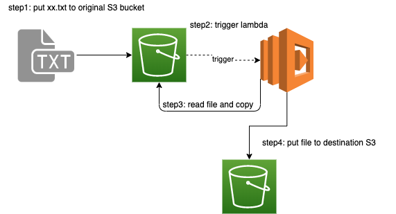
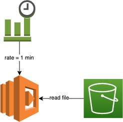
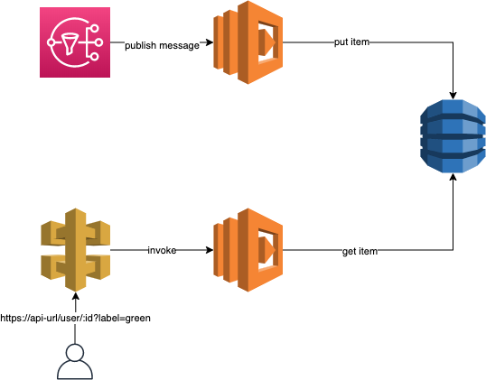

# homework

The resource are deleted.
You can deploy it by the following steps.

## Basic

### Create Lambda which can copy file between S3 by cloudformation



Upload a file with suffix ".txt" to original S3 bucket.
Then trigger the lambda, lambda will read file and copy file to destination S3 bucket.

The cloudformation template is `template-for-lambda-copy-from-s3`.

```
deploy/deploy.sh template-for-lambda-copy-from-s3 ${your-stack-name}
```

## Advanced

### Lambda invoke another one

The lambda `LambdaOneFunction` can invoke lambda `LambdaTwoFunction`.
Currently, lambda one invoke lambda two synchronously (RequestResponse).
If lambda one invoke lambda two asynchronously, add `InvocationType: Event` when invoke.

```
deploy/deploy.sh template-lambda-invoke-another-one ${your-stack-name}
```

### Cloudwatch trigger lambda



The CloudWatch event will trigger lambda by rate 1/min.
The lambda will read the file from S3 bucket.

```
deploy/deploy.sh template-cloudwatch-trigger-lambda ${your-stack-name}
```

### Lambda consumer message from SNS

See the section below.

## Proficient



SNS will trigger a lambda to put item to DynamoDB. This lambda can only put item.
The message which is published by SNS must contain `id` and `label`.
The `id` indicate user is, label is a string, like: "green".

You can get item from DynamoDB by access api gateway.

step1:
```
deploy/deploy-api.sh
```

step2:
copy the command from deploy-api.sh, line 18-22 to deploy.
